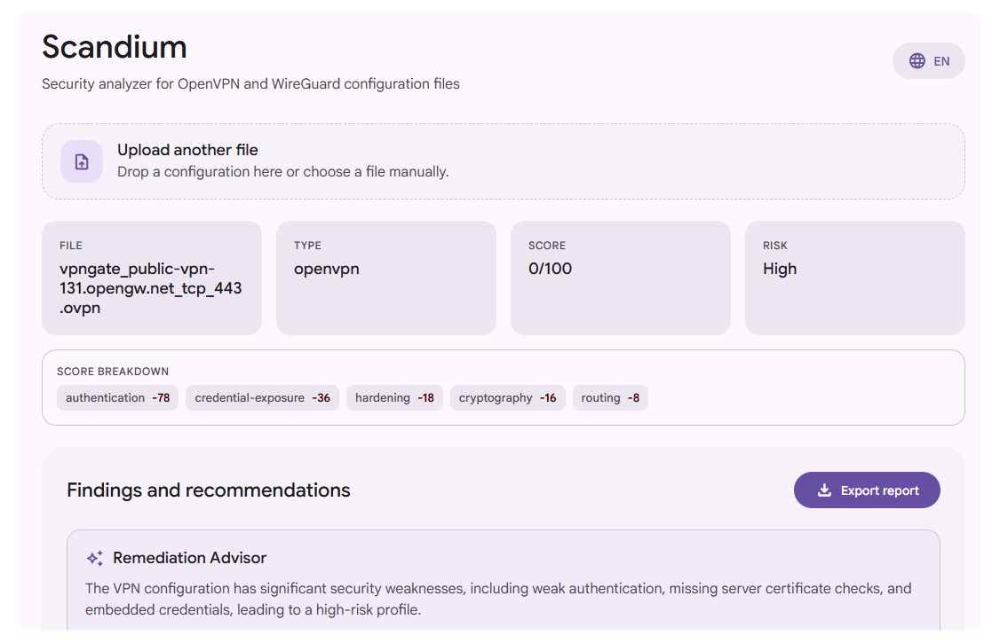

# Scandium - Static VPN Configuration Security Analyzer

Scandium is a desktop static-analysis tool for OpenVPN and WireGuard configuration files. It inspects VPN client profiles without connecting to a VPN server, detects security misconfigurations with a rule-based engine, assigns an explainable risk score, and produces remediation guidance.



## Run

Install dependencies:

```bash
npm install
```

Run the Electrobun desktop app:

```bash
npm run dev
```


## Stack

`TypeScript`
`SolidJS`
`Vite`
`Electrobun`
`Google GenAI SDK`
`Bun`
`Node.js`